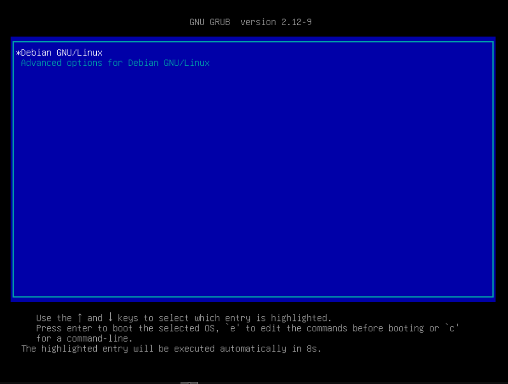
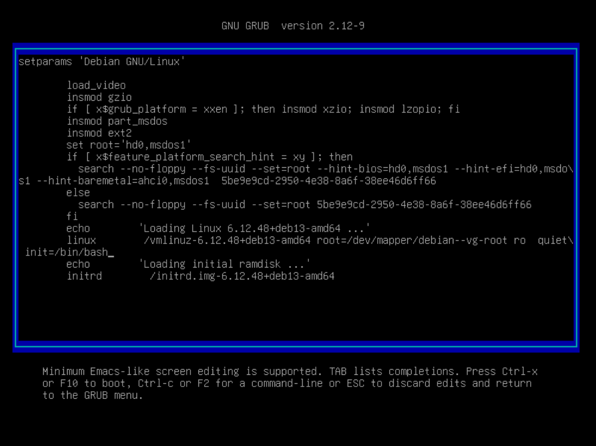
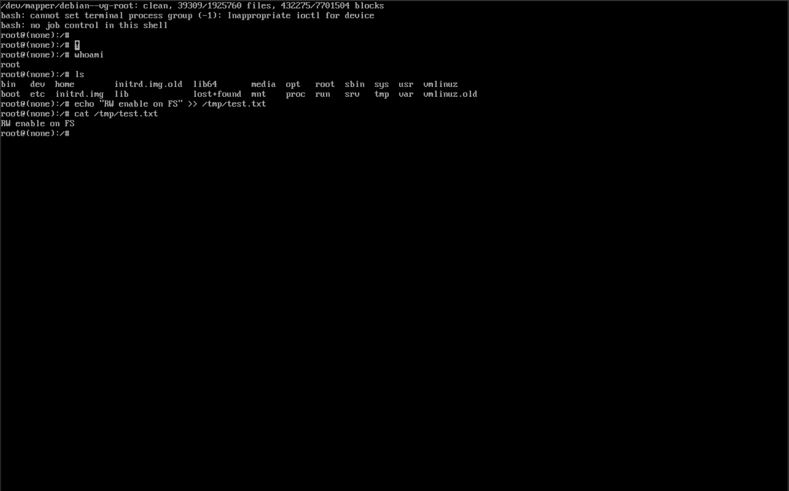
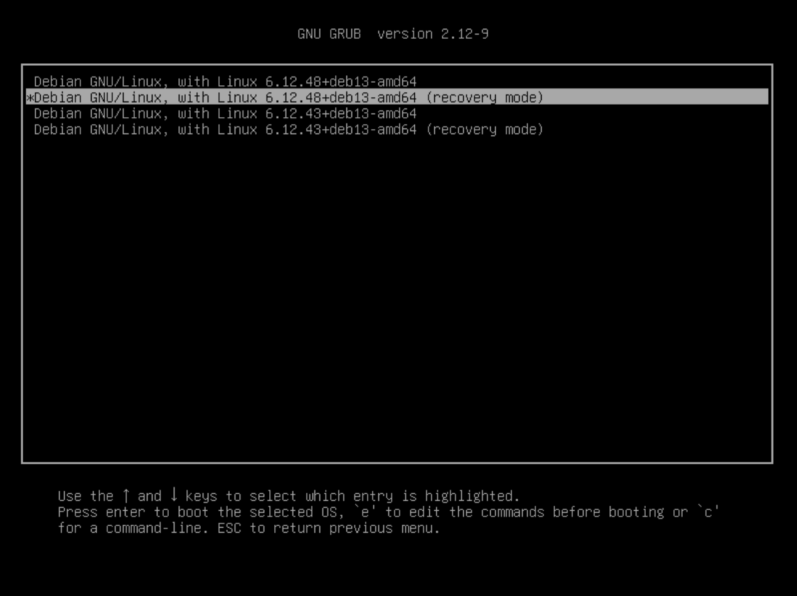
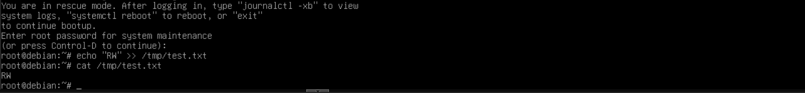

## Домашнее задание

### Работа с загрузчиком
#### Задание

- включить отображение меню `Grub`
- попасть в систему без пароля несколькими способами
- установить систему с `LVM`, после чего переименовать `VG`

#### Отчет

##### Стенд

- Виртуальная машина с ОС `Debian 13`
- ОЗУ: 4 Гб
- ЦПУ: 2 ядра

##### Основное задание

1. Хоть в `Debian 13` и отображается меню `grub` при загрузке, увеличим время задержки до 10 секунд и обновим конфигурацию
```
root@debian:~# nano /etc/default/grub
...
GRUB_TIMEOUT=10
...
root@debian:~# sudo update-grub
Generating grub configuration file ...
Found linux image: /boot/vmlinuz-6.12.48+deb13-amd64
Found initrd image: /boot/initrd.img-6.12.48+deb13-amd64
Found linux image: /boot/vmlinuz-6.12.43+deb13-amd64
Found initrd image: /boot/initrd.img-6.12.43+deb13-amd64
Warning: os-prober will not be executed to detect other bootable partitions.
Systems on them will not be added to the GRUB boot configuration.
Check GRUB_DISABLE_OS_PROBER documentation entry.
Adding boot menu entry for UEFI Firmware Settings ...
done
```

2. Перезагрузим систему
```
root@debian:~# reboot
```

3. Видим меню `grub`

4. Нажимаем на клавиатуре `e` и изменяем строку, которая начинается с `linux...`, также можно поменять `ro` на `rw`, чтобы при загрузке наша файловая система не была `read only`

5. Нажимаем `ctrl+x` и загружаемся в систему. Как видим, мы зашли под пользователем `root` и можем записывать информацию в файловую систему

6. В меню `grub` выбираем пункт `Advanced options...` и выбираем второй пункт с `recovery mode`

7. В процессе установки `Debian 13` я установил пароль для пользователя `root`, поэтому система его просит для входа. После ввода пароля мы сразу попадаем в консоль пользователя `root`

8. Выведем список `Volume Group`
```
root@debian:/home/user# sudo vgs
  VG        #PV #LV #SN Attr   VSize  VFree
  debian-vg   1   2   0 wz--n- 31.04g 36.00m
```
9. Переименуем нашу `Volume Group`, заменим все старые вхождения на новое название в файле `/boot/grub/grub.cfg` и перезагрузимся
```
root@debian:/home/user# sudo vgrename debian-vg changed-otus
  Volume group "debian-vg" successfully renamed to "changed-otus"
root@debian:/boot/grub# sed -i 's/debian\-\-vg/changed\-\-otus/g' grub.cfg
root@debian:/boot/grub# sudo reboot
```
10. Проверим название `Volume Group`
```
root@debian:/home/user# sudo vgs
  VG           #PV #LV #SN Attr   VSize  VFree
  changed-otus   1   2   0 wz--n- 31.04g 36.00m
```